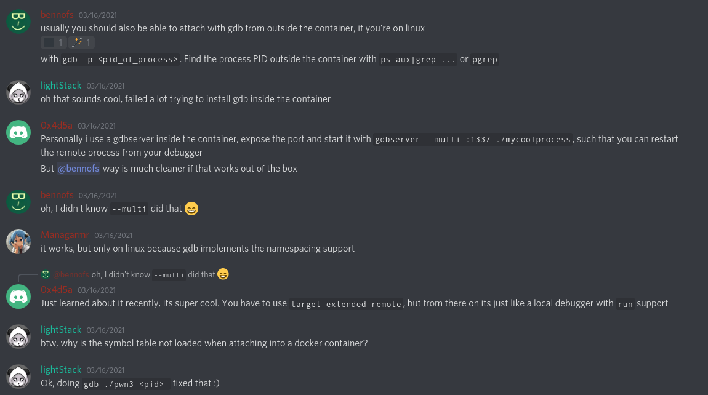

# Demo: docker - gdb - pwntools

This shows how make pwntools attach GDB to a process running inside a docker
container (with a forking server hosting a CTF challenge).

Technique used: 

CTF challenge:
[Not Beginner's Stack](https://github.com/qxxxb/ctf/tree/master/2021/zer0pts_ctf/not_beginners_stack)
from zer0pts CTF 2021.

## Preparation
```
echo -n "0" | sudo tee /proc/sys/kernel/yama/ptrace_scope
```

## Usage
```
docker-compose up
python3 solve.py GDB
```
